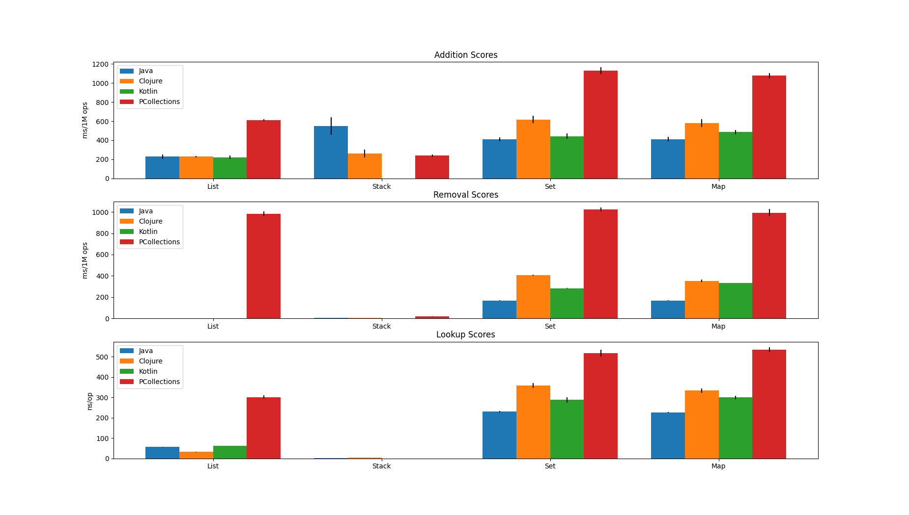

# persistent-collections-benchmark

A set of benchmarks comparing the performance of various operations from four different JVM collections frameworks.

[Jump to the results](#Results)

## Goals

The goal of these benchmarks is to compare the computational performance of **addition**, **removal** and **lookup** on different types of 
persistent collections from three different JVM libraries/languages:

- [clojure.lang](https://clojure.org/reference/data_structures#Collections) (Clojure)
- [kotlinx.collections.immutable](https://github.com/Kotlin/kotlinx.collections.immutable) (Kotlin)
- [pcollections](https://github.com/hrldcpr/pcollections) (Java)

Another goal is to see how persistent collections compare to the mutable
[java.util Collections framework](https://docs.oracle.com/javase/tutorial/collections/intro/index.html).

In summary, the goals are to
- compare the computational performance of `add`-, `remove`- and `get`/`contains`-like methods of the persistent data structures implemented by Clojure, Kotlin and a third-party Java library
-  compare the performance of persistent data structures to mutable data structures in the Java standard library

## Non-Goals
First and most importantly:
**This benchmark does not aim to determine what collections are ultimately better than others in general.**\
It does not emulate a real-world-scenario, because the operations are each benchmarked individually. 
In reality, most uses of collections involve addition, removal and lookup all at once and in a much 
less concentrated fashion. Also, the size of the collections is a significant factor when it comes to speed, 
so there may be notable differences in results when focusing more on collections of different sizes.

Furthermore, this benchmark only considers the ways these collections are *supposed to be* used, i.e.,
it examines the performance of the operations the respective collections were built and optimised for 
(e.g. value-/key-based lookup on sets/maps, random access on vectors/arraylists, 
head/tail lookup on LinkedLists/queues/stacks).
Thus, there are no benchmarks measuring the performance of random access 
on non-random-access collections, for example.

Moreover, memory use and efficiency are not measured.

Lastly, the benchmarks do not cover every operation. For instance, Clojure's vectors and sorted maps 
support a constant time reversing operation that is not included.

In summary, it is **not** a goal to
- ultimately determine what kinds of collections are generally better than others
- claim applicability for every real-world scenario
- benchmark "wrong" uses of collections (random access on a linked list, for example)
- benchmark any sort of memory efficiency

## Structure

Below you can see how many collections are benchmarked in each category for each library. The last column gives information about how long each benchmark takes.

| Benchmark/Subject Benchmark count | Java | PCollections | Kotlin | Clojure |                                     |
| --------------------------------- | ---- | ------------ | ------ | ------- | ----------------------------------- |
| Addition                          | 8    | 5            | 5      | 7       | 5 * 1M ops Warmup, 10 * 1M ops Measurement |
| Removal                           | 8    | 5            | 5      | 6       | 5 * 1M ops Warmup, 10 * 1M ops Measurement  |
| Lookup                            | 8    | 5            | 5      | 7       | 5 * 10s Warmup, 5 * 10s Measurement |

Here are all the collections that are benchmarked. Clojure is missing the removal benchmark for its `PersistentVector`, because it doesn't define an index-based removal operation.

| Data Structure/Library Equivalent   | Java            | PCollections   | Kotlin                 | Clojure             |
| ----------------------------------- | --------------- | -------------- | ---------------------- | ------------------- |
| Random Access List                  | `ArrayList`     | `TreePVector`  | `PersistentVector`     | `PersistentVector`  |
| Queue (FIFO)                        | `LinkedList`    | -              | -                      | `PersistentQueue`   |
| Stack (LIFO)                        | `LinkedList`    | `ConsPStack`   | -                      | `PersistentList`    |
| Unordered Set                       | `HashSet`       | `HashTreePSet` | `PersistentHashSet`    | `PersistentHashSet` |
| Unordered Map                       | `HashMap`       | `HashTreePMap` | `PersistentHashMap`    | `PersistentHashMap` |
| Linked Set (entry order)            | `LinkedHashSet` | -              | `PersistentOrderedSet` | -                   |
| Linked Map (entry order)            | `LinkedHashMap` | -              | `PersistentOrderedMap` | -                   |
| Sorted Set                          | `TreeSet`       | -              | -                      | `PersistentTreeSet` |
| Sorted Map                          | `TreeMap`       | -              | -                      | `PersistentTreeMap` |
| Bag (unordered, duplicate elements) | -               | `HashTreePBag` | -                      | -                   |

- The addition benchmarks fill an empty collection with random strings each iteration

- The removal benchmarks remove elements from a fresh collection each iteration

- The lookup benchmarks lookup random elements/indices from a collection

Every single benchmark is forked 3 times to make up for differences in VM configurations, randomness 
and other environmental factors.

## How to run

If you do want to run everything, do the following:

```
$ git clone https://github.com/johnnyjayjay/persistent-data-structures-benchmark
$ cd persistent-data-structures-benchmark
$ ./gradlew jmh
```

## Results
Many thanks to those who provided their computing power to run these benchmarks for my initial evaluation:

- [Kaliber's results](./plot/results_kali.csv) (Ryzen 5 3600X, 16GB DDR4-3200)
- [PiggyPiglet's results](./plot/results_piglet.csv) (i7-7700K, 32GB DDR4-3200)
- [BomBardyGamer's results](./plot/results_bardy.csv) (Ryzen 7 3700X, ...)

The above results mostly match up and show similar patterns. Here is a simplified view of PiggyPiglet's results:



This graph only shows the 4 most common data types in all 4 libraries:

- `List` (random access list - included because it is the de facto default data structure for most applications)
- `Stack` (aka cons, list - included because it is the simplest persistent data structure)
- `Set` (unordered set)
- `Map` (unordered map)

Lower scores are better, as they indicate execution time.

There are a couple of additional things to note about this data:

- Kotlin does not provide a persistent stack implementation or similar, thus there is no data in those areas.
- For the "List removal" benchmark, only PCollection results are available, because:
  - Clojure does not have indexed-based removal on its vectors
  - Java is too big of an outlier, taking around 20 seconds to remove 1M elements
  - Kotlin is an even bigger outlier, in this case taking over 200 seconds. In the other results, it did not even terminate without timing out.
- The black lines on top of the bars show the 99.9% error relative to the measurement result
- While it is hard to make out, there are indeed removal and lookup results for Stacks. They just happen to be very efficient in those cases, to an extent where the difference between the tested libraries almost becomes insignificant.

## Contributions
Whether you find an issue in the benchmark code, want to improve the default settings or simply want to submit your own benchmark results: Feel free to open an issue or a pull request! The more people work on benchmarks like this, the more useful their results become.
